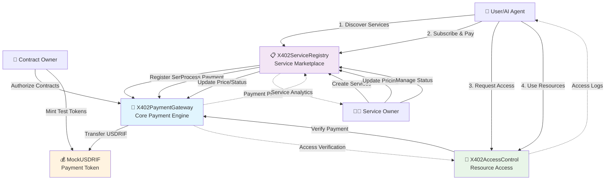
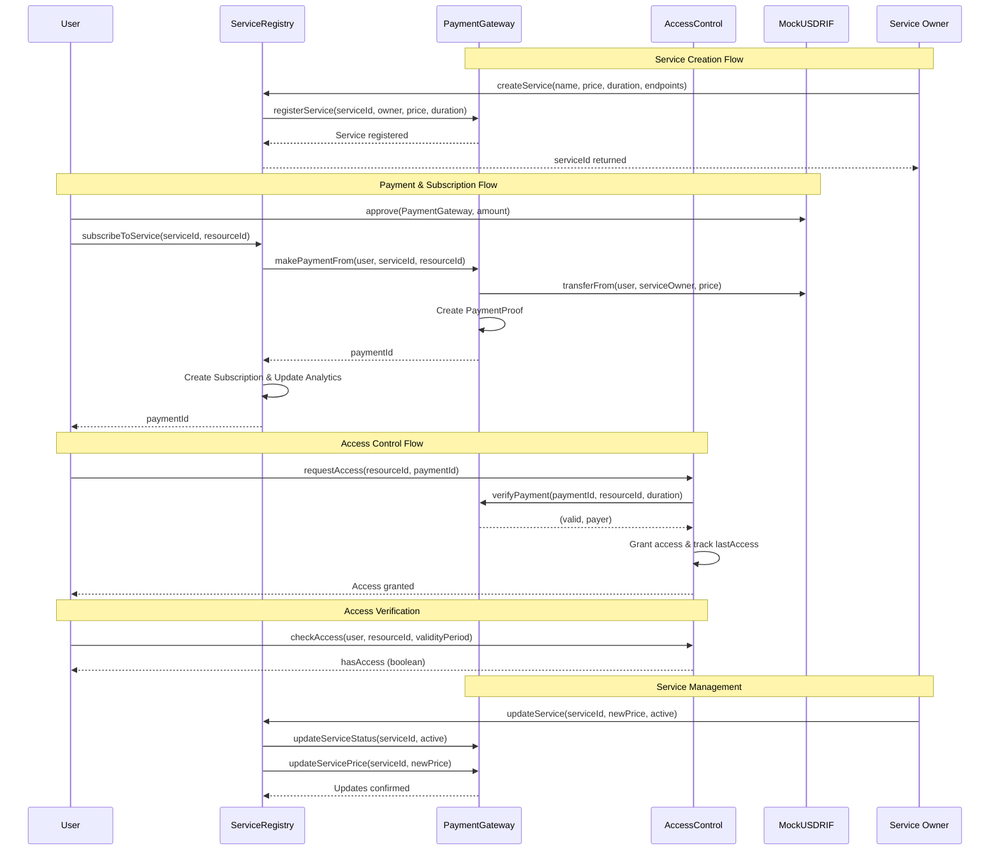
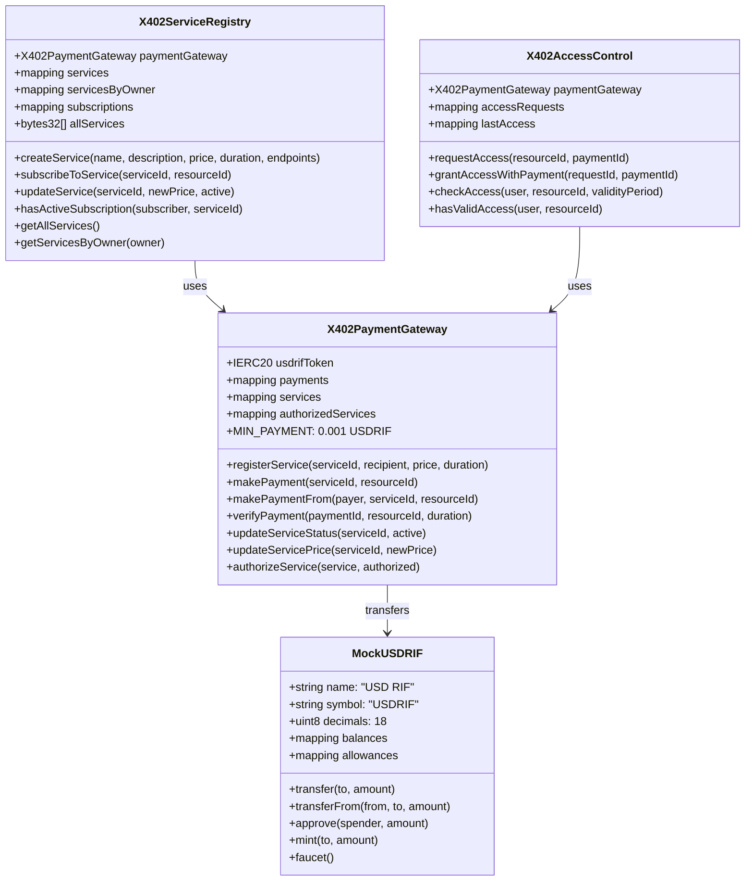
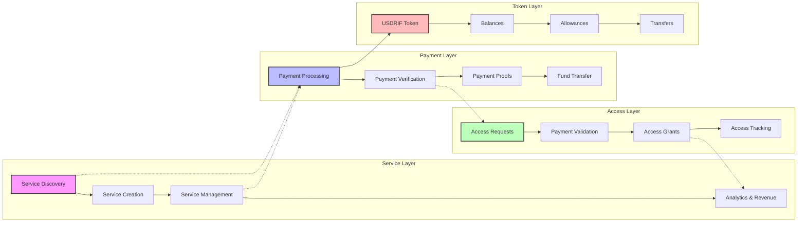
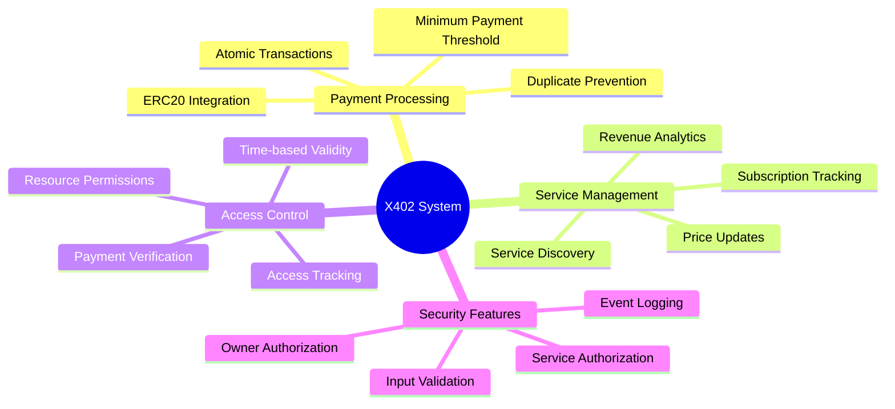
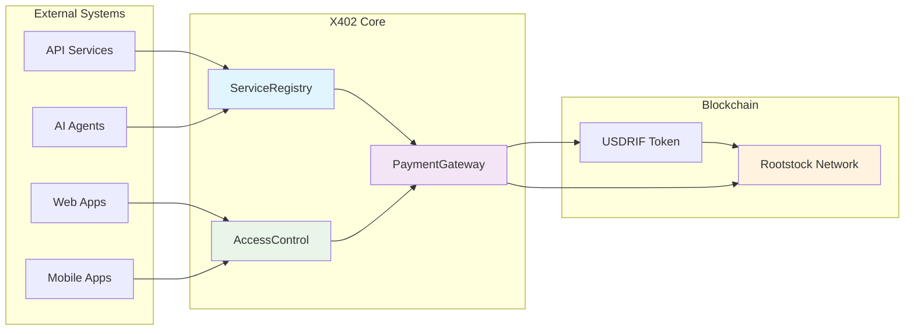

# X402 Payment System Architecture

## System Overview Diagram

## Detailed Contract Interactions

## Contract Architecture Detail

## Data Flow Architecture

## Key Features & Security

## Integration Points

This architecture enables:
- **Scalable Service Discovery**: Easy service registration and discovery
- **Secure Payment Processing**: USDRIF-based payments with verification
- **Flexible Access Control**: Time-based resource access management
- **Comprehensive Analytics**: Revenue and usage tracking
- **Cross-Platform Integration**: Support for various client applications